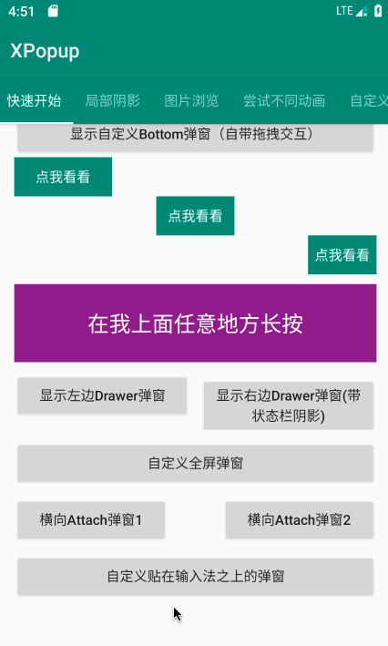

## XPopup
       


<a href="https://tracking.gitads.io/?repo=XPopup"></a>

### You can click the Ad Image to buy me a coffee!!!

### English | [中文]()

Powerful，material UI，elegant interaction general popup！can absolutely replace Dialog，PopupWindow，PopupMenu，BottomSheet，DrawerLayout，Spinner. With built-in many beautiful animation，you can custom your UI and logic！


## ScreenShot

 

 

  

  

  

  

 

 


## Download Apk

Scan qrcode to download Demo.apk：


如果二维码图片不可见，[点我下载Demo体验](http://d.7short.com/2q63)


## Gradle

First, you need add gradle dependency：
```groovy
implementation 'com.lxj:xpopup:1.9.0'
```

Second, you also need these：
```groovy
//version must >= 26
implementation 'com.android.support:appcompat-v7:28.0.0'
implementation 'com.android.support:recyclerview-v7:28.0.0'
implementation 'com.android.support:design:28.0.0'
```


## WIKI

Detailed usage is in wiki，enjoy it:
- [Introduce](https://github.com/li-xiaojun/XPopup/wiki/1.-%E4%BB%8B%E7%BB%8D)
- [How to use built-in popups](https://github.com/li-xiaojun/XPopup/wiki/2.-%E5%86%85%E7%BD%AE%E7%9A%84%E5%BC%B9%E7%AA%97%E5%AE%9E%E7%8E%B0)
- [How to custom your popup](https://github.com/li-xiaojun/XPopup/wiki/3.-%E8%87%AA%E5%AE%9A%E4%B9%89%E5%BC%B9%E7%AA%97)
- [How to custom animator](https://github.com/li-xiaojun/XPopup/wiki/4.-%E8%87%AA%E5%AE%9A%E4%B9%89%E5%8A%A8%E7%94%BB)
- [Popup settings](https://github.com/li-xiaojun/XPopup/wiki/5.-%E5%B8%B8%E7%94%A8%E8%AE%BE%E7%BD%AE)
- [Question](https://github.com/li-xiaojun/XPopup/wiki/6.-%E5%B8%B8%E8%A7%81%E9%97%AE%E9%A2%98)
- [Maybe you want this](https://github.com/li-xiaojun/XPopup/wiki/7.-%E4%B9%9F%E8%AE%B8%E4%BD%A0%E6%83%B3%E8%A6%81%E8%BF%99%E4%BA%9B%E6%95%88%E6%9E%9C)


## Proguard

```
-dontwarn com.lxj.xpopup.widget.**
-keep class com.lxj.xpopup.widget.**{*;}
```


## Who are using XPopup

I prefer you can [click here to provide](https://github.com/li-xiaojun/XPopup/issues/93)your App name，which will give me more passion to maintain this library。

Base on information provided by some friends，they are using Xpopup:
- Gullmap（https://cn.gullmap.com/）
- 马自达汽车检测（主要是一个汽车厂商工作人员使用的汽车检测APP）
- 变福侠App
- 进境肉牛检疫追溯系统(App端)
- 太极 (app名, 下载地址：https://www.coolapk.com/apk/me.weishu.exp)
- 爱勘(ican)App
- 医美消费指南(https://www.pgyer.com/yimeiandroid)
- 蜜尚（APP名，广州时尚商业城有限公司（时尚集团））
- 关爱岛
- 密籍(下载地址：https://www.coolapk.com/apk/com.rair.unikey)
- 万话筒
- 易果无忧
- Moo日记， 下载地址 https://www.wandoujia.com/apps/8044755
- 智华泊位(重庆即停科技有限公司)
- 中英互译（梅州小白科技有限责任公司 https://sj.qq.com/myapp/detail.htm?apkName=com.messi.languagehelper）
- 采蘑菇（https://a.app.qq.com/o/simple.jsp?pkgname=com.lx.cmg）
- 蜂鸟屋APP，蜂鸟屋SAAS 平板
- 茶臻选（https://android.myapp.com/myapp/detail.htm?apkName=com.aiso.tea&ADTAG=mobile）


## Buy me a coffee

If this library helped you，you can buy me a coffee. [reward list](https://github.com/li-xiaojun/XPopup/blob/master/reward-list.md)


## Contact way

QQ Group：**783659607**

Gmail: lxj16167479@gmail.com

QQ Email: 16167479@qq.com

QQ: 16167479


## Licenses

```
 Copyright 2019 li-xiaojun

 Licensed under the Apache License, Version 2.0 (the "License");
 you may not use this file except in compliance with the License.
 You may obtain a copy of the License at

     http://www.apache.org/licenses/LICENSE-2.0

 Unless required by applicable law or agreed to in writing, software
 distributed under the License is distributed on an "AS IS" BASIS,
 WITHOUT WARRANTIES OR CONDITIONS OF ANY KIND, either express or implied.
 See the License for the specific language governing permissions and
 limitations under the License.
```
