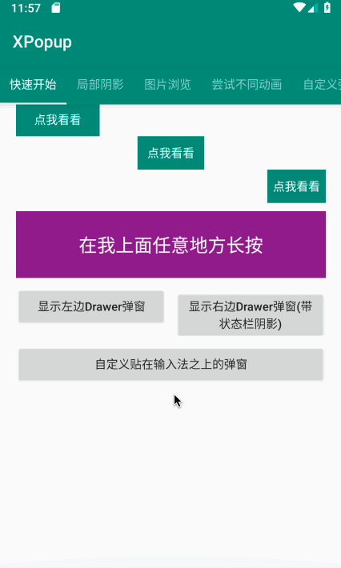
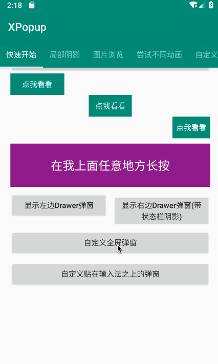
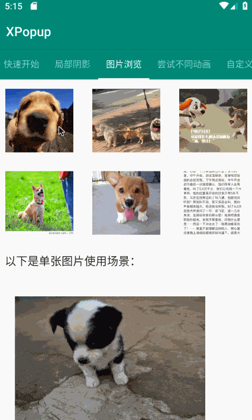
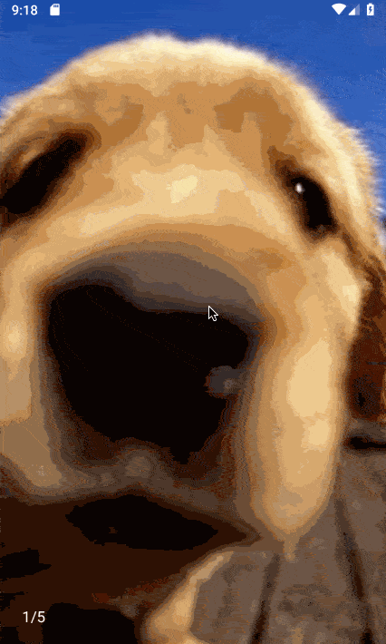

## XPopup
       


### English | 

Powerful，material UI，elegant interaction general popup！can absolutely replace Dialog，PopupWindow，PopupMenu，BottomSheet，DrawerLayout，Spinner. With built-in many beautiful animation，you can custom your UI and logic！


## ScreenShot

 

 

  

  

  

  

 


## Download Apk
Scan qrcode to download Demo.apk：


If the qrcode is invisible，[click me to download Demo.apk](https://fir.im/2q63)

## Gradle
First, you need add gradle dependency：
```groovy
implementation 'com.lxj:xpopup:1.7.3'
//for androidx.
implementation 'com.lxj:xpopup:1.7.3-x'
```

Second, you also need these：
```groovy
//version must >= 26
implementation 'com.android.support:appcompat-v7:28.0.0'
implementation 'com.android.support:recyclerview-v7:28.0.0'
implementation 'com.android.support:design:28.0.0'
```

## WIKI
Detailed usage is in wiki，enjoy it:
- [Introduce](https://github.com/li-xiaojun/XPopup/wiki/1.-%E4%BB%8B%E7%BB%8D)
- [How to use built-in popups](https://github.com/li-xiaojun/XPopup/wiki/2.-%E5%86%85%E7%BD%AE%E7%9A%84%E5%BC%B9%E7%AA%97%E5%AE%9E%E7%8E%B0)
- [How to custom your popup](https://github.com/li-xiaojun/XPopup/wiki/3.-%E8%87%AA%E5%AE%9A%E4%B9%89%E5%BC%B9%E7%AA%97)
- [How to custom animator](https://github.com/li-xiaojun/XPopup/wiki/4.-%E8%87%AA%E5%AE%9A%E4%B9%89%E5%8A%A8%E7%94%BB)
- [Popup settings](https://github.com/li-xiaojun/XPopup/wiki/5.-%E5%B8%B8%E7%94%A8%E8%AE%BE%E7%BD%AE)


## Proguard
```
-dontwarn com.lxj.xpopup.widget.**
-keep class com.lxj.xpopup.widget.**{*;}
```


## Who are use XPopup
I prefer you can [click here to provide](https://github.com/li-xiaojun/XPopup/issues/93)your App name，which will give me more passion to maintain this library。

Base on information provided by some friends，they are using Xpopup:
- Gullmap（https://cn.gullmap.com/）
- 马自达汽车检测（主要是一个汽车厂商工作人员使用的汽车检测APP）
- 变福侠App
- 进境肉牛检疫追溯系统(App端)
- 太极 (app名, 下载地址：https://www.coolapk.com/apk/me.weishu.exp)


## Contact way


Gmail: lxj16167479@gmail.com

QQ Email: 16167479@qq.com

QQ: 16167479

## Licenses
```
 Copyright 2019 li-xiaojun

 Licensed under the Apache License, Version 2.0 (the "License");
 you may not use this file except in compliance with the License.
 You may obtain a copy of the License at

     http://www.apache.org/licenses/LICENSE-2.0

 Unless required by applicable law or agreed to in writing, software
 distributed under the License is distributed on an "AS IS" BASIS,
 WITHOUT WARRANTIES OR CONDITIONS OF ANY KIND, either express or implied.
 See the License for the specific language governing permissions and
 limitations under the License.
```