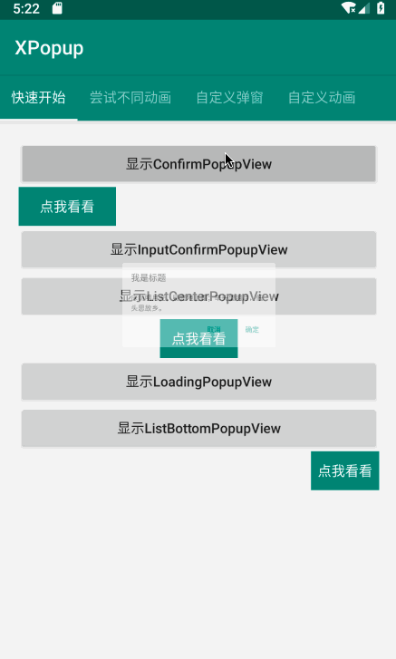

## XPopup
    

功能强大，UI简洁，交互优雅的通用弹窗！可以替代Dialog，PopupWindow，PopupMenu，BottomSheet等组件，自带十几种效果良好的动画，
支持完全的UI和动画自定义！

编写本库的初衷有以下几点：
1. 项目有这样常见需求：中间和底部弹出甚至可拖拽的对话框，指定位置的PopupMenu或者PopupWindow，指定区域阴影的弹出层效果
2. 市面上已有的类库要么功能不足够，要么交互效果不完美，有着普遍的缺点，就像BottomSheet存在的问题一样。比如：窗体消失的动画和背景渐变动画不一致，窗体消失后半透明背景仍然停留一会儿

设计思路：

综合常见的弹窗场景，我将其分为3类：
1. Center类型，就是在中间弹出的弹窗，比如确认和取消弹窗，Loading弹窗
2. Bottom类型，就是从页面底部弹出，比如从底部弹出的分享窗体，知乎的从底部弹出的评论列表
3. Attach类型，就是弹窗的位置需要依附于某个View，就像系统的PopupMenu效果一样，但自定义性很强

动画设计：

为了增加交互的趣味性，遵循Material Design，在设计动画的时候考虑了很多细节，过渡，层级的变化。具体可以从Demo中感受。


## Gradle
```groovy
implementation 'com.lxj:xpopup:latest release'
```


## ScreenShot

 

 


## 使用
为了方便使用，已经内置了几种常见弹窗的实现：
1. 显示确认和取消对话框
    ```java
    XPopup.get(getContext()).asConfirm("我是标题", "我是内容",
                            new OnConfirmListener() {
                                @Override
                                public void onConfirm() {
                                   toast("click confirm");
                                }
                            })
                            .show();
    ```
2. 显示带输入框的确认和取消对话框
    ```java
    XPopup.get(getContext()).asInputConfirm("我是标题", "请输入内容。",
                            new OnInputConfirmListener() {
                                @Override
                                public void onConfirm(String text) {
                                    toast("input text: " + text);
                                }
                            })
                            .show();
    ```
3. 显示中间弹出的列表弹窗
    ```java
    XPopup.get(getActivity()).asCenterList("请选择一项",new String[]{"条目1", "条目2", "条目3", "条目4"},
                            new OnSelectListener() {
                                @Override
                                public void onSelect(int position, String text) {
                                    toast("click "+text);
                                }
                            })
                            .show();
    ```
4. 显示中间弹出的加载框
    ```java
    XPopup.get(getActivity()).asLoading().show();
    ```
5. 显示从底部弹出的列表弹窗
    ```java
    XPopup.get(getActivity()).asBottomList("请选择一项",new String[]{"条目1", "条目2", "条目3", "条目4","条目5"},
                            new OnSelectListener() {
                                @Override
                                public void onSelect(int position, String text) {
                                    toast("click "+text);
                                }
                            })
                            .show();
    ```
6. 显示依附于某个View的弹窗
    ```java
    XPopup.get(getActivity()).asAttachList(new String[]{"分享", "编辑", "不带icon"},
                            new int[]{R.mipmap.ic_launcher, R.mipmap.ic_launcher},
                            new OnSelectListener() {
                                @Override
                                public void onSelect(int position, String text) {
                                    toast("click "+text);
                                }
                            })
                            .atView(v)  // 依附于所点击的View，必须设置
                            .show();
    ```
7. 关闭弹窗
    ```java
    XPopup.get(getContext()).dismiss();
    ```


## 待办
- [ ] Bottom类型的弹出支持手势拖拽，就像知乎的评论弹窗那样
- [ ] 手指长按弹出弹窗，就像微信的列表长按效果
- [ ] 局部阴影覆盖的弹窗，就像淘宝的商品列表筛选框那样