## XPopup
       


<a href="https://tracking.gitads.io/?repo=XPopup"></a>

### 欢迎请点击上面的广告来支持一下！！！

### 2.0版本重磅来袭，底层改为Dialog实现，并带来可观的动画性能优化和交互细节的提升，数十个Bug修复！！！

### 中文 | [English](https://github.com/li-xiaojun/XPopup/blob/master/README-en.md)

功能强大，UI简洁，交互优雅的通用弹窗，可能是Android平台最好的弹窗库！可以替代Dialog，PopupWindow，PopupMenu，BottomSheet，DrawerLayout，Spinner等组件！它有这样几个特点：
- 功能强大，内部封装了常用的弹窗，内置十几种良好的动画，将弹窗和动画的自定义设计的极其简单；目前还没有出现XPopup实现不了的弹窗效果。
  内置弹窗允许你使用项目已有的布局，同时还能用上XPopup提供的动画，交互和逻辑封装。
- UI和动画简洁，遵循Material Design，在设计动画的时候考虑了很多细节，过渡，层级的变化；或者说是模拟系统组件的动画，具体可以从Demo中感受
- 交互优雅，实现了优雅的手势交互，智能的嵌套滚动，智能的输入法交互，具体看Demo
- 适配全面屏，目前适配了小米，华为，谷歌，OPPO，VIVO，三星，魅族，一加全系全面屏手机
- 自动监听Activity生命周期，自动释放资源。在Activity直接finish的场景也避免了内存泄漏
- 很好的易用性，所有的自定义弹窗只需继承对应的类，实现你的布局，然后像Activity那样，在`onCreate`方法写逻辑即可
- 性能优异，动画流畅；精心优化的动画，让你很难遇到卡顿场景
- 能在应用后台弹出（需要申请悬浮窗权限，一行代码即可）
- 支持androidx
- **如果你想要时间选择器弹窗和城市选择器弹窗，可以使用XPopup扩展功能库XPopupExt： https://github.com/li-xiaojun/XPopupExt**

**设计思路**：
综合常见的弹窗场景，我将其分为几类：
- Center类型，就是在中间弹出的弹窗，比如确认和取消弹窗，Loading弹窗
- Bottom类型，就是从页面底部弹出，比如从底部弹出的分享窗体，知乎的从底部弹出的评论列表，我内部会处理好手势拖拽和嵌套滚动
- Attach类型，就是弹窗的位置需要依附于某个View或者某个触摸点，就像系统的PopupMenu效果一样，但PopupMenu的自定义性很差，淘宝的商品列表筛选的下拉弹窗，微信的朋友圈点赞弹窗都是这种。
- DrawerLayout类型，就是从窗体的坐边或者右边弹出，并支持手势拖拽；好处是与界面解耦，可以在任何界面显示DrawerLayout
- ImageViewer大图浏览类型，就像掘金那样的图片浏览弹窗，带有良好的拖拽交互体验，内部嵌入了改良的PhotoView
- 全屏弹窗，弹窗是全屏的，就像Activity那样，可以设置任意的动画器；适合用来实现登录，选择性的界面效果。
- Position自由定位弹窗，弹窗是自由的，你可放在屏幕左上角，右下角，或者任意地方，结合强大的动画器，可以实现各种效果。


## 演示
|内置弹窗（支持复用已有布局）|列表Center弹窗|
|:---:|:---:|
|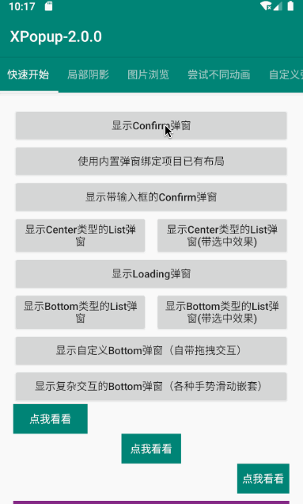|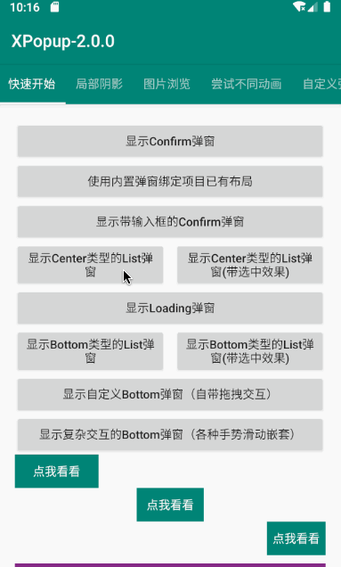|

|Bottom列表弹窗(手势拖拽，横竖滚动) | 自定义Bottom弹窗（天然支持嵌套滚动，多层弹窗）|
|:---:|:---:|
|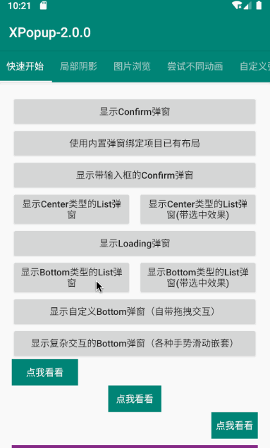|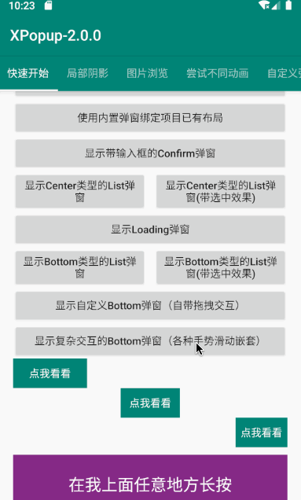|

|Attach弹窗(动画优雅，智能定位，长按支持) | 自定义Attach弹窗（任意方向支持，灵活易用）|
|:---:|:---:|
|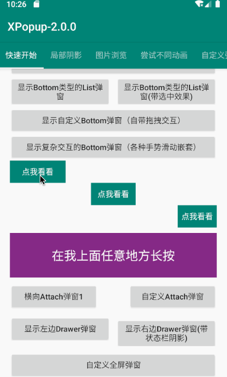||

|Drawer弹窗(手势拖拽，状态栏阴影) | 全屏弹窗（可作为Activity替代品，搭配十几个动画使用更佳）|
|:---:|:---:|
|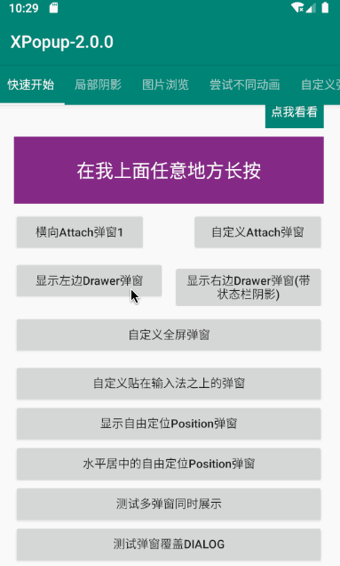|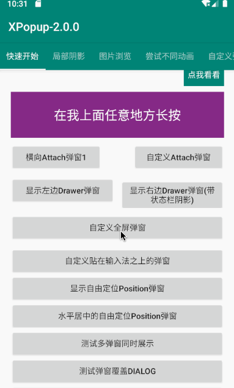|

|Position自由定位弹窗(放在屏幕任意地方) | 自定义贴在输入法之上的弹窗|
|:---:|:---:|
|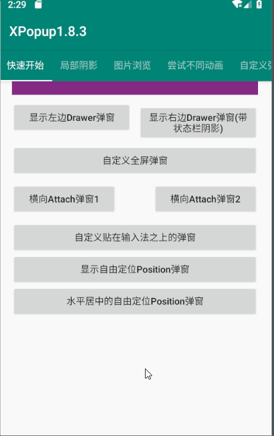|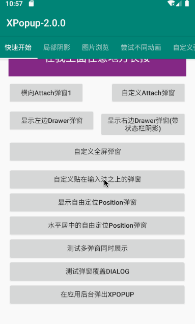|

|PartShadow局部阴影弹窗 | 向上向下都可以|
|:---:|:---:|
|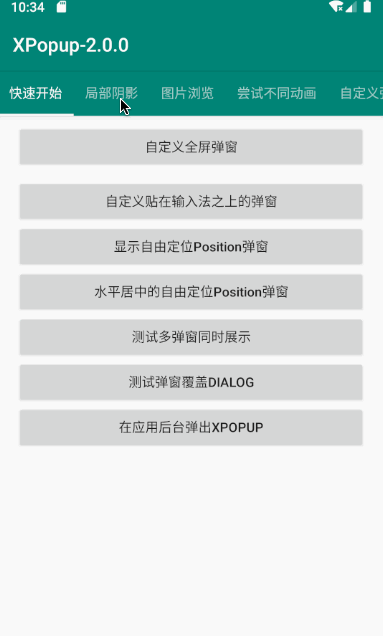|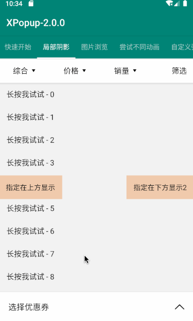|

|ImageViewer大图浏览弹窗（拖拽自然，如丝般顺滑） | 超长图片支持（图像渐变过渡，优雅从容）|
|:---:|:---:|
|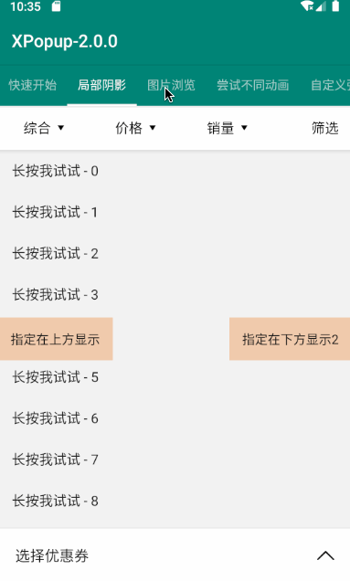||

|大图浏览弹窗，支持界面自定义 | 配合ViewPager使用|
|:---:|:---:|
|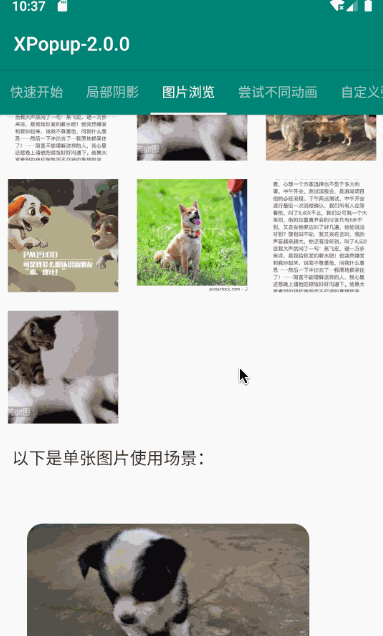|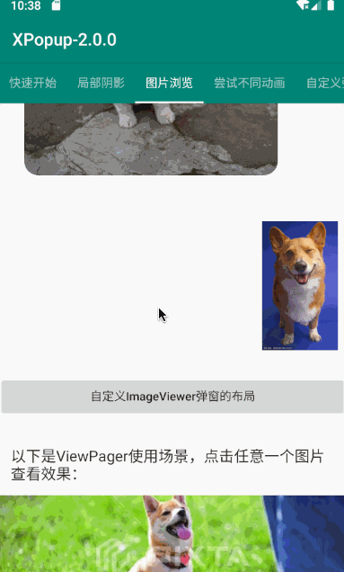|

|自定义弹窗和自定义动画 | 内置优雅美观的动画器，可搭配弹窗结合使用|
|:---:|:---:|
|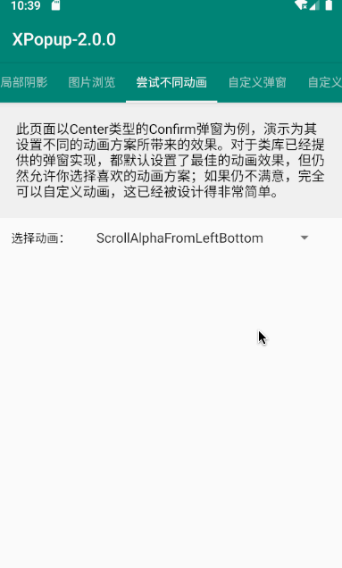|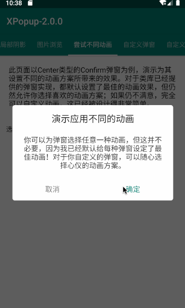|

|应用后台弹出（一行代码实现权限申请） | 联想搜索实现，轻而易举|
|:---:|:---:|
|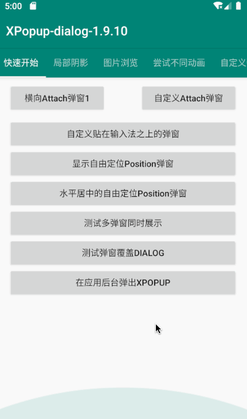|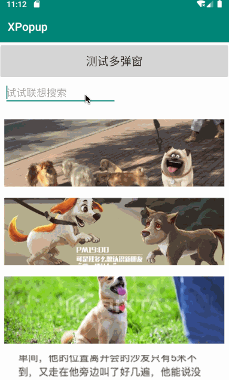|


## 快速体验

Gif录制的有些卡顿，真机预览效果更佳。扫描二维码下载Demo：


如果二维码图片不可见，[点我下载Demo体验](http://d.7short.com/2q63)

## Gradle

```groovy
implementation 'com.lxj:xpopup:最新版本'
```

必须添加的依赖库，版本号在26以及以上即可，版本不用和我一致：
```groovy
implementation 'com.android.support:appcompat-v7:28.0.0'
implementation 'com.android.support:recyclerview-v7:28.0.0'
implementation 'com.android.support:design:28.0.0'
```
如果你是androidx，则上面三个对应的androidx依赖是，版本不用和我一致：
```groovy
implementation 'androidx.appcompat:appcompat:1.1.0'
implementation 'com.google.android.material:material:1.3.0-alpha01'
implementation 'androidx.recyclerview:recyclerview:1.1.0'
```

## 使用文档

具体使用方法全在WIKI中，请查看下面各个章节：
- [如何使用内置的弹窗](https://github.com/li-xiaojun/XPopup/wiki/2.-%E5%86%85%E7%BD%AE%E7%9A%84%E5%BC%B9%E7%AA%97%E5%AE%9E%E7%8E%B0)
- [如何自定义弹窗](https://github.com/li-xiaojun/XPopup/wiki/3.-%E8%87%AA%E5%AE%9A%E4%B9%89%E5%BC%B9%E7%AA%97)
- [如何自定义动画](https://github.com/li-xiaojun/XPopup/wiki/4.-%E8%87%AA%E5%AE%9A%E4%B9%89%E5%8A%A8%E7%94%BB)
- [弹窗常用设置](https://github.com/li-xiaojun/XPopup/wiki/5.-%E5%B8%B8%E7%94%A8%E8%AE%BE%E7%BD%AE)
- [常见问题](https://github.com/li-xiaojun/XPopup/wiki/6.-%E5%B8%B8%E8%A7%81%E9%97%AE%E9%A2%98)
- [也许你想要这些效果](https://github.com/li-xiaojun/XPopup/wiki/7.-%E4%B9%9F%E8%AE%B8%E4%BD%A0%E6%83%B3%E8%A6%81%E8%BF%99%E4%BA%9B%E6%95%88%E6%9E%9C)
- [一行代码在应用后台弹出弹窗](https://github.com/li-xiaojun/XPopup/wiki/8.-%E4%B8%80%E8%A1%8C%E4%BB%A3%E7%A0%81%E5%9C%A8%E5%BA%94%E7%94%A8%E5%90%8E%E5%8F%B0%E5%BC%B9%E5%87%BA%E5%BC%B9%E7%AA%97)
- [时间选择器弹窗和城市选择器弹窗](https://github.com/li-xiaojun/XPopup/wiki/9.-%E6%88%91%E6%83%B3%E8%A6%81%E6%97%B6%E9%97%B4%E9%80%89%E6%8B%A9%E5%99%A8%E6%88%96%E5%9F%8E%E5%B8%82%E9%80%89%E6%8B%A9%E5%99%A8%E5%BC%B9%E7%AA%97)


## 混淆

```
-dontwarn com.lxj.xpopup.widget.**
-keep class com.lxj.xpopup.widget.**{*;}
```


## 谁在用XPopup

我本人很希望您能[点击这里附上](https://github.com/li-xiaojun/XPopup/issues/93)使用这个库的App名或者公司名，这样会给我更大的动力和热情去维护这个类库。

根据热心朋友提供的信息，目前使用XPopup的产品和公司有：
- 海鸥地图（https://cn.gullmap.com/）
- 马自达汽车检测（主要是一个汽车厂商工作人员使用的汽车检测APP）
- 变福侠App
- 进境肉牛检疫追溯系统(App端)
- 太极 (,维术大神作品，VirtualXposed作者， 下载地址：https://www.coolapk.com/apk/me.weishu.exp)
- 爱勘(ican)App
- 医美消费指南(https://www.pgyer.com/yimeiandroid)
- 蜜尚（APP名，广州时尚商业城有限公司（时尚集团））
- 关爱岛
- 密籍(下载地址：https://www.coolapk.com/apk/com.rair.unikey)
- 万话筒
- 易果无忧
- Moo日记， 下载地址 https://www.wandoujia.com/apps/8044755
- 智华泊位(重庆即停科技有限公司)
- 中英互译（梅州小白科技有限责任公司 https://sj.qq.com/myapp/detail.htm?apkName=com.messi.languagehelper）
- 采蘑菇（https://a.app.qq.com/o/simple.jsp?pkgname=com.lx.cmg）
- 蜂鸟屋APP
- 蜂鸟屋SAAS 平板
- 茶臻选（https://android.myapp.com/myapp/detail.htm?apkName=com.aiso.tea&ADTAG=mobile）
- 风扇屏客户端app
- EdifierConnect 漫步者耳机产品APP
- 斑猪(广州汇数创联科技有限公司)
- 夜探(成都波斯猫)
- 极光影院(个人开发者，可到公众号极光终点站下载)
- 万码（深圳市靠谱软件有限公司）
- 爱多路（常州玺拓软件有限公司 https://a.app.qq.com/o/simple.jsp?pkgname=com.hitotech.idoru）
- 有播（公司：浙江有播科技有限公司 https://android.myapp.com/myapp/detail.htm?apkName=com.haibaoshow.youbo）
- 微寻互助（app）
- 米袋出行(上海米袋投资集团有限公司（米袋集团）)
- 米袋汽车(上海米袋投资集团有限公司（米袋集团）)
- 悦动圈(下载地址：https://www.51yund.com/down?from=default&type=android)
- 路马帮App
- 椰子姐姐App(学习英语的App)
- 橙杏健康App，橙杏守护App（北京橙杏有道有限公司）
- 红星直播（红星美凯龙旗下的直播App）
- 花生代理App (http://www.appchina.com/app/com.qi.earthnutproxy)
- 小鹅通商家助手APP
- 小鹅通课堂助手APP
- 小鹅通助手APP
- 豌豆掌管
- 干货集中营(下载地址：https://juejin.im/post/5ef7fdbaf265da22be0d6ab3)
- 运动指南针(http://app.mi.com/details?id=com.lx.yundong&ref=search)
- 我惠省钱(http://app.mi.com/details?id=com.lx.whsq&ref=search)
- 中航人商城(http://app.mi.com/details?id=com.lx.zhrshop&ref=search)
- 求职墙(https://www.pgyer.com/zhaopin 密码 000000)


## 打个赏

如果你觉得我帮助到了你，节省了你的时间，可以对我进行打赏（打赏时可以附上自己的大名和Github地址），金额随意，以表支持。[打赏名单](https://github.com/li-xiaojun/XPopup/blob/master/reward-list.md)


## 阿里云链接
如果有朋友购买阿里云服务器，可以点我的链接进入：

https://www.aliyun.com/minisite/goods?userCode=bak7qpav

有大量的代金券和折扣！！！

ECS-1核2G40G硬盘1M带宽 ： 91元/年

ECS-2核4G40G硬盘1M带宽 ： 414元/年

ECS-4核8G40G硬盘5M带宽 ： 1046元/年

更多产品点击链接进入查看。。。


## 联系方式

XPopup交流群：**783659607**

Gmail: lxj16167479@gmail.com

QQ Email: 16167479@qq.com

QQ: 16167479


## Licenses

```
 Copyright 2019 li-xiaojun

 Licensed under the Apache License, Version 2.0 (the "License");
 you may not use this file except in compliance with the License.
 You may obtain a copy of the License at

     http://www.apache.org/licenses/LICENSE-2.0

 Unless required by applicable law or agreed to in writing, software
 distributed under the License is distributed on an "AS IS" BASIS,
 WITHOUT WARRANTIES OR CONDITIONS OF ANY KIND, either express or implied.
 See the License for the specific language governing permissions and
 limitations under the License.
```