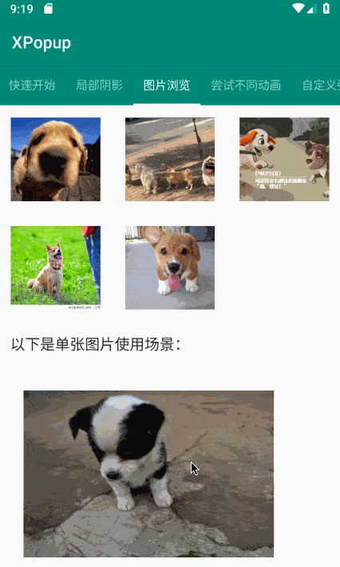

## XPopup
       


功能强大，UI简洁，交互优雅的通用弹窗！可以替代Dialog，PopupWindow，PopupMenu，BottomSheet，DrawerLayout，Spinner等组件，自带十几种效果良好的动画，
支持完全的UI和动画自定义！它有这样几个特点：
1. 功能强大，内部封装了常用的弹窗，内置十几种良好的动画，将弹窗和动画的自定义设计的极其简单
2. UI和动画简洁，遵循Material Design，在设计动画的时候考虑了很多细节，过渡，层级的变化；或者说是模拟系统组件的动画，具体可以从Demo中感受
3. 交互优雅，实现了优雅的手势交互以及智能的嵌套滚动，具体看Demo
4. 适配全面屏，目前适配了小米，华为，谷歌，OPPO，VIVO，三星，魅族，一加全系全面屏手机
5. 通用性，项目需求复杂多变，产品经理天马行空，虽然很难做到UI的通用，但是你可以看到交互和动画完全可以通用；至于弹窗的UI和逻辑可能需要你自定义
6. 易用性，所有的自定义弹窗只需继承对应的类，实现你的布局，然后在`onCreate`方法写逻辑即可


**编写本库的初衷有以下几点**：
1. 项目有这样常见需求：中间和底部弹出甚至可拖拽的对话框，指定位置的PopupMenu或者PopupWindow，指定区域阴影的弹出层效果
2. 市面上已有的类库要么功能不足够，要么交互效果不完美，有着普遍的缺点，就像BottomSheet存在的问题一样。比如：窗体消失的动画和背景渐变动画不一致，窗体消失后半透明背景仍然停留一会儿

**设计思路**：
综合常见的弹窗场景，我将其分为几类：
1. Center类型，就是在中间弹出的弹窗，比如确认和取消弹窗，Loading弹窗
2. Bottom类型，就是从页面底部弹出，比如从底部弹出的分享窗体，知乎的从底部弹出的评论列表，我内部会处理好手势拖拽和嵌套滚动
3. Attach类型，就是弹窗的位置需要依附于某个View或者某个触摸点，就像系统的PopupMenu效果一样，但PopupMenu的自定义性很差，淘宝的商品列表筛选的下拉弹窗也属于这种，微信的朋友圈点赞弹窗也是这种。
4. DrawerLayout类型，就是从窗体的坐边或者右边弹出，并支持手势拖拽；好处是与界面解耦，可以在任何界面显示DrawerLayout
5. 大图浏览类型，就像掘金那样的图片浏览弹窗，带有良好的拖拽交互体验
6. 全屏弹窗，弹窗是全屏的，就像Activity那样，可以设置任意的动画器；适合用来实现登录，选择性的界面效果。


## ScreenShot

 

 

  

  

  

  

 


## 快速体验Demo
扫描二维码下载Demo：


如果二维码图片不可见，[点我下载Demo体验](https://fir.im/2q63)

## 使用
首先需要添加Gradle依赖：
```groovy
//注意：1.6.0之后的API大幅重构，不兼容之前的API，但是扩展性更好，请酌情升级。
//注意：1.6.0之后的API大幅重构，不兼容之前的API，但是扩展性更好，请酌情升级。
//注意：1.6.0之后的API大幅重构，不兼容之前的API，但是扩展性更好，请酌情升级。
implementation 'com.lxj:xpopup:1.6.8'

//重构之前的版本
//implementation 'com.lxj:xpopup:1.5.2'
```

必须添加的依赖库：
```groovy
//版本号在26以及以上即可
implementation 'com.android.support:appcompat-v7:28.0.0'
implementation 'com.android.support:recyclerview-v7:28.0.0'
implementation 'com.android.support:design:28.0.0'
```


为了方便使用，已经内置了几种常见弹窗的实现：
1. **显示确认和取消对话框**
    ```java
    new XPopup.Builder(getContext()).asConfirm("我是标题", "我是内容",
                            new OnConfirmListener() {
                                @Override
                                public void onConfirm() {
                                   toast("click confirm");
                                }
                            })
                            .show();
    ```
2. **显示带输入框的确认和取消对话框**
    ```java
    new XPopup.Builder(getContext()).asInputConfirm("我是标题", "请输入内容。",
                            new OnInputConfirmListener() {
                                @Override
                                public void onConfirm(String text) {
                                    toast("input text: " + text);
                                }
                            })
                            .show();
    ```
3. **显示中间弹出的列表弹窗**
    ```java
    new XPopup.Builder(getContext())
                            //.maxWidth(600)
                            .asCenterList("请选择一项", new String[]{"条目1", "条目2", "条目3", "条目4"},
                            new OnSelectListener() {
                                @Override
                                public void onSelect(int position, String text) {
                                    toast("click " + text);
                                }
                            })
                            .show();
    ```
4. **显示中间弹出的加载框**
    ```java
    new XPopup.Builder(getContext())
                            .asLoading("正在加载中")
                            .show();
    ```
5. **显示从底部弹出的列表弹窗**
    ```java
    // 这种弹窗从 1.0.0版本开始实现了优雅的手势交互和智能嵌套滚动
    new XPopup.Builder(getContext())
                            .asBottomList("请选择一项", new String[]{"条目1", "条目2", "条目3", "条目4", "条目5"},
                            new OnSelectListener() {
                                @Override
                                public void onSelect(int position, String text) {
                                    toast("click " + text);
                                }
                            })
                            .show();
    ```
6. **显示依附于某个View或者某个点的弹窗**
    ```java
    new XPopup.Builder(getContext())
                            .atView(v)  // 依附于所点击的View，内部会自动判断在上方或者下方显示
                            .asAttachList(new String[]{"分享", "编辑", "不带icon"},
                            new int[]{R.mipmap.ic_launcher, R.mipmap.ic_launcher},
                            new OnSelectListener() {
                                @Override
                                public void onSelect(int position, String text) {
                                    toast("click " + text);
                                }
                            })
                            .show();
    ```
    如果是想依附于某个View的触摸点，则需要先`watch`该View，然后当单击或长按触发的时候去显示：
    ```java
    // 必须在事件发生前，调用这个方法来监视View的触摸
    final XPopup.Builder builder = new XPopup.Builder(getContext())
                    .watchView(view.findViewById(R.id.btnShowAttachPoint));
    view.setOnLongClickListener(new View.OnLongClickListener() {
        @Override
        public boolean onLongClick(View v) {
            builder.asAttachList(new String[]{"置顶", "复制", "删除"}, null,
                                    new OnSelectListener() {
                                        @Override
                                        public void onSelect(int position, String text) {
                                            toast("click " + text);
                                        }
                                    })
                                    .show();
            return false;
        }
    });
    ```
    
    **`asAttachList`方法内部是对AttachPopupView的封装，如果你的布局不是列表，可以继承AttachPopupView实现自己想要的布局。**
    **AttachPopupView会出现在目标的上方或者下方，如果你想要出现在目标的左边或者右边（像微信朋友圈那样点赞的弹窗），可以继承HorizontalAttachPopupView，然后编写你的布局即可。**
    
    最简单示例如下：
    ```java
    public class CustomAttachPopup extends HorizontalAttachPopupView {
        public CustomAttachPopup(@NonNull Context context) {
            super(context);
        }
    
        @Override
        protected int getImplLayoutId() {
            return R.layout.custom_attach_popup;
        }
    
        @Override
        protected void onCreate() {
            super.onCreate();
            findViewById(R.id.tv_zan).setOnClickListener(new OnClickListener() {
                @Override
                public void onClick(View v) {
                    ToastUtils.showShort("赞");
                }
            });
            findViewById(R.id.tv_comment).setOnClickListener(new OnClickListener() {
                @Override
                public void onClick(View v) {
                    ToastUtils.showShort("评论");
                }
            });
        }
    }
    ```
    

7. **关闭弹窗**

    ```java
    dismiss();
    ```

8. **自定义弹窗**

    当你自定义弹窗的时候，需要选择继承`CenterPopupView`，`BottomPopupView`，`AttachPopupView/HorizontalAttachPopupView`，`DrawerPopupView`，`PartShadowPopupView`其中之一。假设需要自定义Center类型的弹窗：
    ```java
    class CustomPopup extends CenterPopupView{
            //自定义弹窗本质是一个自定义View，但是只需重写这个构造，其他的不用重写
            public CustomPopup(@NonNull Context context) {
                super(context);
            }
            // 返回自定义弹窗的布局
            @Override
            protected int getImplLayoutId() {
                return R.layout.custom_popup;
            }
            // 执行初始化操作，比如：findView，设置点击，或者任何你弹窗内的业务逻辑
            @Override
            protected void onCreate() {
                super.onCreate();
                findViewById(R.id.tv_close).setOnClickListener(new OnClickListener() {
                    @Override
                    public void onClick(View v) {
                        dismiss(); // 关闭弹窗
                    }
                });
            }
            // 设置最大宽度，看需要而定
            @Override
            protected int getMaxWidth() {
                return super.getMaxWidth();
            }
            // 设置最大高度，看需要而定
            @Override
            protected int getMaxHeight() {
                return super.getMaxHeight();
            }
            // 设置自定义动画器，看需要而定
            @Override
            protected PopupAnimator getPopupAnimator() {
                return super.getPopupAnimator();
            }
        }
    ```
    使用自定义弹窗：
    ```java
    new XPopup.Builder(getContext())
            .asCustom(new CustomPopup(getContext()))
            .show();
    ```

9. **自定义动画**

    自定义动画已经被设计得非常简单，动画和弹窗是无关的；这意味着你可以将动画设置给内置弹窗或者自定义弹窗。继承`PopupAnimator`，实现3个方法：
    - 如何初始化动画
    - 动画如何开始
    - 动画如何结束

    比如：自定义一个旋转的动画：
    ```java
    class RotateAnimator extends PopupAnimator{
            @Override
            public void initAnimator() {
                targetView.setScaleX(0);
                targetView.setScaleY(0);
                targetView.setAlpha(0);
                targetView.setRotation(360);
            }
            @Override
            public void animateShow() {
                targetView.animate().rotation(0).scaleX(1).scaleY(1).alpha(1).setInterpolator(new FastOutSlowInInterpolator()).setDuration(animateDuration).start();
            }
            @Override
            public void animateDismiss() {
                targetView.animate().rotation(360).scaleX(0).scaleY(0).alpha(0).setInterpolator(new FastOutSlowInInterpolator()).setDuration(animateDuration).start();
            }
        }
    ```
    使用自定义动画：
    ```java
    new XPopup.Builder(getContext())
                        .customAnimator(new RotateAnimator())
                        .asConfirm("演示自定义动画", "当前的动画是一个自定义的旋转动画，无论是自定义弹窗还是自定义动画，已经被设计得非常简单；这个动画代码只有6行即可完成！", null)
                        .show();
    ```

10. **显示DrawerLayout类型弹窗**

    对于DrawerLayout类型的弹窗，我只能帮你做好弹窗效果和手势交互。里面的UI和逻辑是无法帮你完成的，所以需要自定义一个弹窗，继承`DrawerPopupView`。代码非常简单，如下：
    ```java
    public class CustomDrawerPopupView extends DrawerPopupView {
        public CustomDrawerPopupView(@NonNull Context context) {
            super(context);
        }
        @Override
        protected int getImplLayoutId() {
            return R.layout.custom_drawer_popup;
        }
        @Override
        protected void onCreate() {
            super.onCreate();
            findViewById(R.id.btn).setOnClickListener(new OnClickListener() {
                @Override
                public void onClick(View v) {
                    Toast.makeText(getContext(), "nothing!!!", Toast.LENGTH_SHORT).show();
                }
            });
        }
    }
    ```
    使用自定义的DrawerLayout弹窗：
    ```java
    new XPopup.Builder(getContext())
            .popupPosition(PopupPosition.Right)//右边
            .hasStatusBarShadow(true) //启用状态栏阴影
            .asCustom(new CustomDrawerPopupView(getContext()))
            .show();
    ```


11. **自定义局部阴影弹窗**

    这种效果从分类上看仍然是Attach类型，因为要依附于某个View，在其上方或者下方显示。常见于列表条件筛选弹窗，比如京东或者淘宝的商品列表筛选。同样我只能帮你把复杂的交互效果做了，弹窗里面的UI和逻辑需要你自己继承`PartShadowPopupView`来做，这当然非常简单。
    最简单的示例如下：
    ```java
    public class CustomPartShadowPopupView extends PartShadowPopupView {
        public CustomPartShadowPopupView(@NonNull Context context) {
            super(context);
        }
        @Override
        protected int getImplLayoutId() {
            return R.layout.custom_part_shadow_popup; // 编写你自己的布局
        }
        @Override
        protected void onCreate() {
            super.onCreate();
            // 实现一些UI的初始和逻辑处理
        }
    }
    ```
    显示的时候仍然需要指定atView显示，内部会智能判断应该如何展示以及使用最佳的动画器：
    ```java
    new XPopup.Builder(getContext())
        .atView(ll_container)
        .asCustom(new CustomPartShadowPopupView(getContext()))
        .show();
    ```


12. **自定义Bottom类型的弹窗**

    自定义Bottom类型的弹窗会比较常见，默认Bottom弹窗带有手势交互和嵌套滚动；如果您不想要手势交互可以调用`enableDrag(false)`方法关闭。

    如果弹窗内有输入框，在弹出输入法的情况下，弹窗默认会贴附在输入法之上，并且保证不会盖住输入框；目前Center和Bottom类型弹窗有此效果。

    请注意：**弹窗的宽高是自适应的，大部分情况下都应该将弹窗布局的高设置为`wrap_content`；除非你希望得到一个高度撑满的弹窗。**

    Demo中有一个模仿知乎评论的实现，代码在这里：
    ```java
    public class ZhihuCommentPopup extends BottomPopupView {
        VerticalRecyclerView recyclerView;
        public ZhihuCommentPopup(@NonNull Context context) {
            super(context);
        }
        @Override
        protected int getImplLayoutId() {
            return R.layout.custom_bottom_popup;
        }

        @Override
        protected void onCreate() {
            super.onCreate();
            recyclerView = findViewById(R.id.recyclerView);

            ArrayList<String> strings = new ArrayList<>();
            for (int i = 0; i < 30; i++) {
                strings.add("");
            }
            CommonAdapter<String> commonAdapter = new CommonAdapter<String>(R.layout.adapter_zhihu_comment, strings) {
                @Override
                protected void bind(@NonNull ViewHolder holder, @NonNull String s, int position) {}
            };
            commonAdapter.setOnItemClickListener(new MultiItemTypeAdapter.SimpleOnItemClickListener(){
                @Override
                public void onItemClick(View view, RecyclerView.ViewHolder holder, int position) {
                    dismiss();
                }
            });
            recyclerView.setAdapter(commonAdapter);
        }
        // 最大高度为Window的0.85
        @Override
        protected int getMaxHeight() {
            return (int) (XPopupUtils.getWindowHeight(getContext())*.85f);
        }
    }
    ```

13. **大图浏览弹窗**

    这种弹窗多用于App内列表中图片进行详细展示的场景，用法如下：
    ```java
    // 多图片场景
    new XPopup.Builder(getContext()).asImageViewer(imageView, position, list, new OnSrcViewUpdateListener() {
            @Override
            public void onSrcViewUpdate(ImageViewerPopupView popupView, int position) {
                // 作用是当Pager切换了图片，需要更新源View
                popupView.updateSrcView((ImageView) recyclerView.getChildAt(position));
            }
        }, new ImageLoader())
        .show();

    // 单张图片场景
    new XPopup.Builder(getContext())
        .asImageViewer(imageView, url, new ImageLoader())
        .show();

    // 图片加载器，我不负责加载图片，需要你实现一个图片加载器传给我，这里以Glide为例。
    class ImageLoader implements XPopupImageLoader {
            @Override
            public void loadImage(int position, @NonNull String url, @NonNull ImageView imageView) {
                Glide.with(imageView).load(url).into(imageView);
            }
            //必须实现这个方法，返回uri对应的缓存文件，可参照下面的实现，内部保存图片会用到。
            @Override
            public File getImageFile(@NonNull Context context, @NonNull Object uri) {
                try {
                    return Glide.with(context).downloadOnly().load(uri).submit().get();
                } catch (Exception e) {
                    e.printStackTrace();
                }
                return null;
            }
        }
    ```
    注意事项：假设你使用Glide加载图片，如果你的ImageView是CenterCrop的，那么加载的时候一定要指定大小为`Target.SIZE_ORIGINAL`；
    这样会禁止Glide裁剪图片，保证可以拿到原始图片，让图片过渡动画变的天衣无缝。例如：
    ```java
    Glide.with(imageView).load(s).apply(new RequestOptions().override(Target.SIZE_ORIGINAL))
                        .into(imageView);
    ```
    如果你使用其他类库加载图片，请保证加载的图片没有被裁剪过。


14. **其他**
- 设置主色调

    默认情况下，XPopup的主色为灰色，主色作用于Button文字，EditText边框和光标，Check文字的颜色上。主色调只需要设置一次即可，可以放在Application中设置。
  ```java
  XPopup.setPrimaryColor(getResources().getColor(R.color.colorPrimary));
  ```
- 设置全局的动画时长
  
    默认情况下，弹窗的动画时长为360毫秒。你可以通过下面的方法进行修改：
    ```java
    XPopup.setAnimationDuration(300); // 如果传入的值小于200会被忽略，动画的时长会影响除Drawer弹窗外的所有弹窗
    ```  

- 常用设置
  ```java
  new XPopup.Builder(getContext())
      .hasShadowBg(true) // 是否有半透明的背景，默认为true
      .dismissOnBackPressed(true) // 按返回键是否关闭弹窗，默认为true
      .dismissOnTouchOutside(true) // 点击外部是否关闭弹窗，默认为true
      .autoDismiss(false) // 操作完毕后是否自动关闭弹窗，默认为true；比如点击ConfirmPopup的确认按钮，默认自动关闭；如果为false，则不会关闭
      .autoOpenSoftInput(true) //是否弹窗显示的同时打开输入法，只在包含输入框的弹窗内才有效，默认为false
      .popupAnimation(PopupAnimation.ScaleAlphaFromCenter) // 设置内置的动画
      .customAnimator(null) // 设置自定义的动画器
      .moveUpToKeyboard(false) // 软键盘弹出时，弹窗是否移动到软键盘上面，默认为true
      .popupPosition(PopupPosition.Right)//手动指定弹窗出现在目标的什么位置，对Attach和Drawer类型弹窗生效
      .hasStatusBarShadow(false) //是否有状态栏阴影，目前对Drawer弹窗和FullScreen弹窗生效
      .offsetX(-10) //弹窗在x方向的偏移量
      .offsetY(-10) //弹窗在y方向的偏移量
      .enableDrag(true) //是否启用拖拽，默认为true，目前对Bottom弹窗有用
      .isCenterHorizontal(true)//默认为false，默认情况下Attach弹窗依靠着目标的左边或者右边，如果isCenterHorizontal为true，则与目标水平居中对齐
      .isRequestFocus(false)//默认为true，默认情况下弹窗会抢占焦点，目的是为了响应返回按键按下事件；如果为false，则不抢焦点
      .setPopupCallback(new XPopupCallback() { //设置显示和隐藏的回调
          @Override
          public void onShow() {
              // 完全显示的时候执行
          }
          @Override
          public void onDismiss() {
              // 完全隐藏的时候执行
          }
      })
      // 设置弹窗的最大宽高，只对Center和Bottom类型弹窗生效。默认情况下，弹窗的布局是自适应的，如果你设置了最大宽高，则弹窗的宽高不会超过你设置的值！
      // 如果你重写了`getMaxWidth()`和`getMaxHeight()`方法，此方法设置的值会被覆盖；
      .maxWidth(300)
      .maxHeight(400)
      // 如果你想要一个全屏的弹窗，有3种方式：
      // 1. 首先布局要都是`match_parent`，然后调用上面的方法设置这个值为window的宽高即可。
      // 2. 可以重写`getMaxWidth()`和`getMaxHeight()`方法，效果是一样的。
      // 3. 可以继承FullScreenPopupView，直接编写布局即可。
      .asXXX()
  ```

- 数据和状态保存

    如果每次显示都new一个，由于每次都是新的弹窗，状态无法保存。可以选择记录下：
    ```java
    CustomDrawerPopupView drawerPopupView = new CustomDrawerPopupView(getContext());

    //使用弹窗
    new XPopup.Builder(getContext())
                    .popupPosition(PopupPosition.Right)//右边
                    .hasStatusBarShadow(true) //启用状态栏阴影
                    .asCustom(drawerPopupView)
                    .show();
    ```

- 在RecyclerView中长按弹出弹窗，这种场景需要watch一下itemView：

    ```java
    CommonAdapter adapter = new CommonAdapter<String>(android.R.layout.simple_list_item_1, data) {
        @Override
        protected void bind(@NonNull ViewHolder holder, @NonNull String s, int position) {
            holder.setText(android.R.id.text1, "长按我试试 - " + position);
            //必须要在事件发生之前就watch
            final XPopup.Builder builder = new XPopup.Builder(getContext()).watchView(holder.itemView);
            holder.itemView.setOnLongClickListener(new View.OnLongClickListener() {
                @Override
                public boolean onLongClick(View v) {
                    builder.asAttachList(new String[]{"置顶", "编辑", "删除"}, null,0,10, new OnSelectListener() {
                        @Override
                        public void onSelect(int position, String text) {
                            ToastUtils.showShort(text);
                        }
                    }).show();
                    return true;
                }
            });
        }
    };
    ```


- 最佳实践

    我们在项目中经常会点击某个按钮然后关闭弹窗，接着去做一些事。比如：点击一个按钮，关闭弹窗，然后开启一个界面：
    ```java
    dismiss();
    getContext().startActivity(new Intent(getContext(), DemoActivity.class));
    ```
    要知道弹窗的关闭是有一个动画过程的，上面的写法会出现弹窗还没有完全关闭，就立即跳页面，界面有一种顿挫感；而且在设备资源不足的时候，还可能造成丢帧。

    为了得到最佳体验，您可以等dismiss动画完全结束去执行一些东西，而不是立即就执行。可以这样做：
    ```java
    dismissWith(new Runnable() {
        @Override
        public void run() {
            getContext().startActivity(new Intent(getContext(), DemoActivity.class));
        }
    });
    ```
    每个弹窗本身也有`onShow()`和`onDismiss()`的生命周期回调，可以根据需要使用。

## 混淆
```
-dontwarn com.lxj.xpopup.widget.**
-keep class com.lxj.xpopup.widget.**{*;}
```


## 谁在用XPopup
根据热心群众提供的信息，目前使用XPopup的产品和公司有：
- 海鸥地图（https://cn.gullmap.com/）
- 马自达汽车检测（主要是一个汽车厂商工作人员使用的汽车检测APP）
- 变福侠App
- 进境肉牛检疫追溯系统(App端)


## 联系方式


Gmail: lxj16167479@gmail.com

QQ Email: 16167479@qq.com

QQ: 16167479